# EDA Titanic (Kaggle) — Guía de uso (Windows 10 + Git Bash + uv)

Este repositorio contiene un ejemplo de **Análisis Exploratorio de Datos (EDA)** del clásico dataset **Titanic** (Kaggle), pensado para principiantes. La guía explica cómo instalar dependencias con **uv**, descargar los datos de **Kaggle**, abrir el proyecto en **JupyterLab** y ejecutar el notebook paso a paso.

Se busca también la práctica de cargado y limpieza de datos, estadísticas descriptivas y visualización con Python, pandas, matplotlib y seaborn, además de el flujo de trabajo con uv y JupyterLab. No está orientado a producción; los resultados son demostrativos y con fines estrictamente educativos.

---

# Introducción al EDA

Un **Análisis Exploratorio de Datos (EDA)** es esencial en cualquier proyecto de datos. 
Es básicamente ese primer vistazo que le damos a un dataset o un conjunto de datos, para conocerlo y entenderlo antes de aplicar modelos o técnicas avanzadas de análisis o de entrenar cualquier modelo de IA, revisándolo por si hay errores en el mismo, con valores atípicos, falta de datos y/o patrones interesantes.

“Si no hacemos EDA antes de analizar nuestros datos es como armar un rompecabezas sin haber mirado la imagen.” “Es como un detective que investiga nuestros datos.”

El **Análisis Exploratorio de Datos (EDA)**, fue **desarrollado por el matemático estadounidense John Tukey en la década de 1970** y se caracteriza por ser un proceso investigativo en el que se utilizan herramientas estadísticas descriptivas y de visualización para examinar conjuntos de datos (el dataset), descubrir patrones, detectar anomalías, probar hipótesis y verificar supuestos mediante estadísticas de resumen y representaciones gráficas.

El EDA combina métodos estadísticos y visualizaciones gráficas para:

    •	Comprender la estructura y características de los datos
    •	Identificar patrones, tendencias y relaciones entre variables
    •	Detectar valores atípicos y anomalías
    •	Evaluar la calidad de los datos (valores faltantes, inconsistencias)
    •	Generar hipótesis para análisis posteriores
    •	Preparar los datos para modelado de Machine Learning

    
El EDA no buscar confirmar hipótesis estadísticas preestablecidas, sino generar nuevas preguntas. Se trata de analizar los datos con curiosidad y sin prejuicios, permitiendo obtener patrones inesperados y/o relaciones ocultas que puedan guiar a futuros análisis. El objetivo es conocer los datos antes de realizar cualquier tipo de hipótesis para guiar a los analistas en la toma de decisiones, es obtener un dataset "limpio", preparado para su análisis y modelado. Es conocer los datos y qué se puede aprender de ellos. Para ello se aplican estrategias para su limpieza y transformación, que redundarán en la calidad de los modelos predictivos y analíticos.  

En esta guía, exploramos algunas técnicas y herramientas para realizar un análisis exploratorio efectivo.

---

## 1) Requisitos

- **Git Bash** (puedes usar VS Code si quieres).
- **uv** instalado y accesible en tu PATH. Comprueba:
  ```bash
  uv --version
  ```
- **Python 3.9+** (recomendado 3.10–3.12).
- **JupyterLab** (se instala como dependencia).
- **Cuenta Kaggle** y **kaggle.json** (para descargar los CSV).

> Si no quieres usar Kaggle, puedes cargar el dataset de `seaborn` (necesita internet). En este repo lo usamos desde **Kaggle** para que cualquiera pueda replicar sin depender de la conectividad.

---

## 2) Instalación de dependencias

### Opción A — Proyecto con `pyproject.toml` (recomendada con uv)
Si este repositorio ya trae un `pyproject.toml`, simplemente:

```bash
# 1) Clona el repo
git clone https://github.com/TU_USUARIO/eda-titanic-kaggle.git
cd eda-titanic-kaggle

# 2) Crea el entorno
uv venv .venv

# 3) Instala dependencias declaradas en el TOML
uv sync
```

> Si **no** existe `pyproject.toml` y quieres crearlo con uv:
> ```bash
> uv init --name eda-titanic-kaggle
> uv add pandas matplotlib seaborn scipy scikit-learn jupyterlab ipykernel kaggle
> uv sync
> ```

### Opción B — `requirements.txt` (alternativa clásica)
Si prefieres gestionar deps con `requirements.txt`:

```bash
uv venv .venv
source .venv/Scripts/activate
uv pip install -r requirements.txt
```

> **No mezcles** A y B en el mismo proyecto. Elige un método y quédate con él.

---

## 3) Datos de Kaggle (descarga y preparación)

1) En la web de Kaggle → **Account** → **Create New API Token** → se descarga `kaggle.json`.
2) Colócalo en tu HOME de usuario:
   ```bash
   mkdir -p /c/Users/USUARIO/.kaggle
   mv /c/Users/USUARIO/Downloads/kaggle.json /c/Users/USUARIO/.kaggle/kaggle.json
   chmod 600 /c/Users/USUARIO/.kaggle/kaggle.json
   ```
3) Descarga el dataset de la competición Titanic y descomprime en `data/`:
   ```bash
   uvx kaggle competitions download -c titanic -p data
   unzip data/titanic.zip -d data
   # Esperado: data/train.csv, data/test.csv, data/gender_submission.csv
   ```

---

## 4) Ejecutar el proyecto en JupyterLab

```bash
# Lanza JupyterLab
# (Con venv activado:)
source .venv/Scripts/activate
jupyter lab
# (O sin activar el venv:)
# uv run jupyter lab
```

En JupyterLab:
1. Abre el notebook: `notebooks/eda-titanic-kaggle.ipynb`.
2. Selecciona el **kernel** del entorno (menú **Kernel → Change Kernel…**).  
   - Si no aparece, créalo una vez:
     ```bash
     python -m ipykernel install --user --name eda-titanic --display-name "Python (eda-titanic)"
     ```
     Cierra y vuelve a abrir JupyterLab.
3. Ejecuta todo: **Run → Run All Cells** (o usa `Shift+Enter` por celda).

Los gráficos aparecen **inline** (debajo de cada celda). Los CSV limpios se guardan en la carpeta del proyecto (p. ej. `titanic_clean.csv`, `titanic_encoded.csv`).

---

## 5) Estructura recomendada del proyecto

```
eda-titanic-kaggle/
├─ .venv/                      # entorno virtual (no subir a git)
├─ data/                       # CSVs descargados de Kaggle (opcional subir)
│  ├─ train.csv
│  ├─ test.csv
│  └─ titanic.zip
├─ figures/                    # (opcional) PNGs si decides guardarlos
├─ notebooks/
│  └─ eda-titanic-kaggle.ipynb
├─ pyproject.toml              # O, alternativamente, requirements.txt
├─ requirements.txt            # (si usas este método)
├─ README.md
└─ .gitignore
```

**.gitignore** sugerido:
```
.venv/
__pycache__/
*.ipynb_checkpoints
data/*.zip
.kaggle/
```

> Si no quieres subir los CSV de Kaggle, añade `data/` completo al `.gitignore` y no los incluyas en `git add`.

---

## 6) ¿Necesito guardar imágenes en `figures/`?

**No es obligatorio.** Las salidas de las celdas (gráficas incluidas) quedan **embebidas** dentro del `.ipynb`, por lo que **GitHub** las muestra al visualizar el notebook.  
Solo guarda PNGs en `figures/` si:
- Quieres reutilizarlos (README, informes externos).
- Te preocupa el tamaño del `.ipynb` o su render en GitHub en notebooks muy pesados.
- Prefieres versionar imágenes sueltas.

Para guardar además de mostrar inline:
```python
# antes de plt.show():
import os; os.makedirs("figures", exist_ok=True)
plt.savefig("figures/plot_hist_age.png", dpi=150, bbox_inches="tight")
plt.show()
```

Puedes insertar un PNG guardado en una **celda Markdown** y hacer la referencia al PNG generado en el propio README.md con:
```markdown

```

---

## 7) Descripciones para cada gráfica (añadir como celda Markdown debajo)

- **Histograma de edad** (`age`): distribución de edades; permite ver asimetrías, modas y huecos. Útil para decidir imputación/transformaciones.
- **Conteo `survived` (0/1)**: balance de clases; si hay desbalance fuerte, puede afectar evaluación/modelado.
- **Boxplot `fare` por `survived`**: compara tarifas entre sobrevivientes y no; suele observarse mayor `fare` en quienes sobrevivieron (relación con `pclass`).
- **Conteo `sex` con `hue=survived`**: supervivencia por sexo; en Titanic se observa mayor tasa en mujeres (y niños).
- **Matriz de correlación (numéricas)**: relación lineal entre variables numéricas; útil para detectar colinealidades y posibles predictoras.
- **Boxplot `age`** (outliers IQR): valores extremos en `age`; orientar winsorización, recorte o transformaciones.
- **Boxplot `fare`** (outliers IQR): `fare` suele tener cola larga y outliers altos; considerar escalado/winsorización.

> Añade una **celda de texto (Markdown)** debajo o encima de **cada** celda con gráfico y pega la descripción correspondiente (puedes adaptarla a lo que observes en tus datos).

---

## 8) Subir a GitHub

```bash
git init
git add notebooks/eda-titanic-kaggle.ipynb README.md .gitignore
# Si usas pyproject.toml:
git add pyproject.toml
# O si usas requirements.txt:
git add requirements.txt
# (Opcional) Figuras y/o datos si decides subirlos:
# git add figures/
# git add data/train.csv data/test.csv

git commit -m "EDA Titanic: notebook, dependencias y guía de uso"
git branch -M main
git remote add origin https://github.com/TU_USUARIO/eda-titanic-kaggle.git
git push -u origin main
```

---

## 9) Solución de problemas comunes

- **`kaggle: Could not find kaggle.json`** → coloca el token en `C:\Users\USUARIO\.kaggle\kaggle.json` y repite la descarga.
- **El kernel no aparece** → instala con `python -m ipykernel install ...` y reinicia JupyterLab.
- **Error al imputar (`ValueError: 2`)** → usa `.ravel()` al asignar `fit_transform`, e.g. `df["age"] = SimpleImputer(...).fit_transform(df[["age"]]).ravel()`.
- **`describe(include="object")` falla** → usa `include=["object","category"]` o detecta columnas antes.

---

¡Listo! Con esto, cualquier usuario podrá instalar, ejecutar el notebook, ver los resultados y (si quiere) guardar las gráficas como archivos separados.

---

# Notebook - EDA del Titanic con datos de Kaggle

# Configuración inicial: Imports y ajustes
## Celda 1 — Imports y ajustes:
### Utilidades (guardar imágenes/tablas; no toca README)

---

# FASE 1 Exploración incial. Reconocimiento del Dataset: 
## Celda 2 — cargar Kaggle CSV (normalizamos nombres)
### Carga 891 pasajeros, 15 características Identifica tipos: numéricos vs categóricos vs texto

**Tablas:**
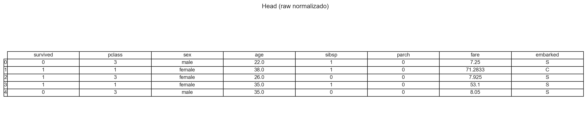

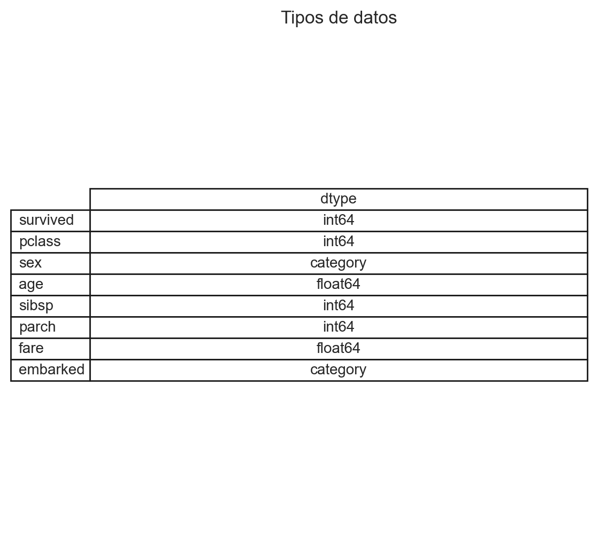

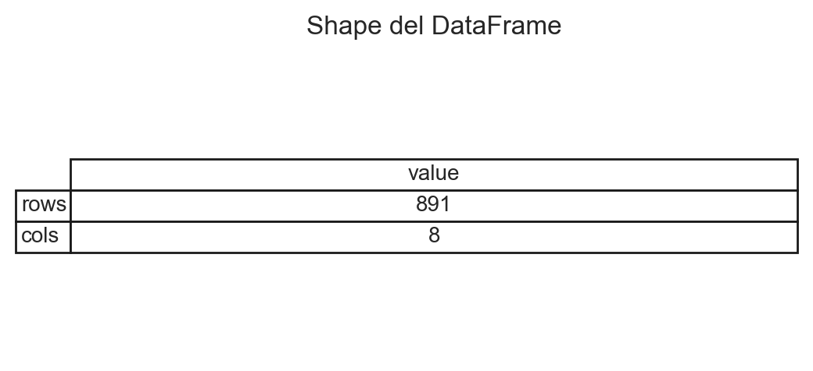

**Qué se hace:**
- Se cargó `data/train.csv` de Kaggle.
- Normalización de nombres: `Survived→survived`, `Pclass→pclass`, etc.
- Ajuste de tipos: `survived`→int, `sex`/`embarked`→category.

---

# FASE 2 Evaluación de la calidad: 
## Celda 3 — Inspección y diagnóstico:
### Detecta: age (177 nulos), cabin (687 nulos), embarked (2 nulos) Estadísticas: 38% supervivencia, edades 0.42-80 años, tarifas 0-512£

**Qué es:** Vista general (nulos, estadística numérica y categórica, cardinalidad).  
**Qué muestra:** Columnas con más nulos; orden de magnitudes y dispersión; niveles de categóricas.  
**Insight:** Priorizar imputación/limpieza en variables con muchos nulos.

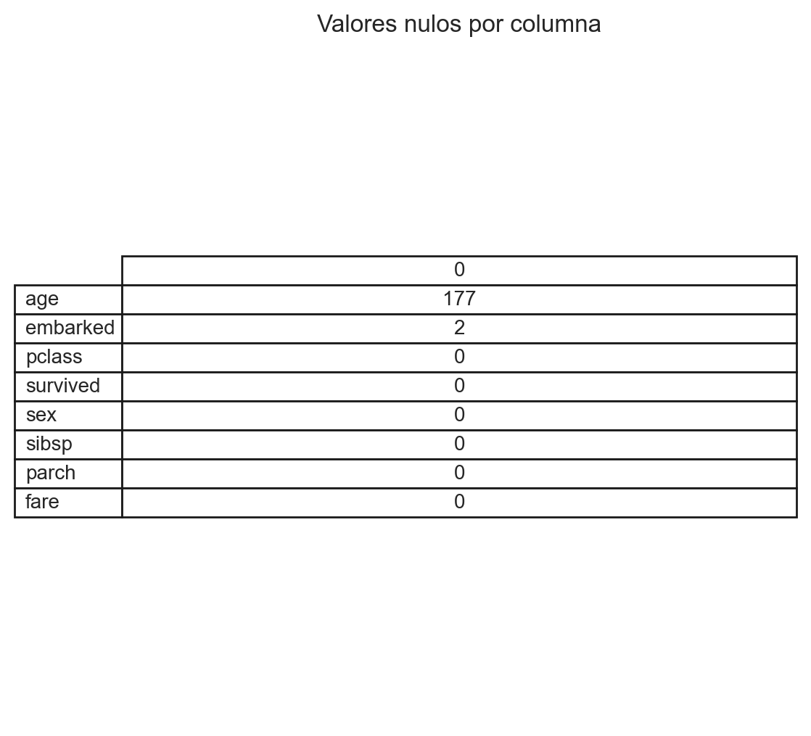

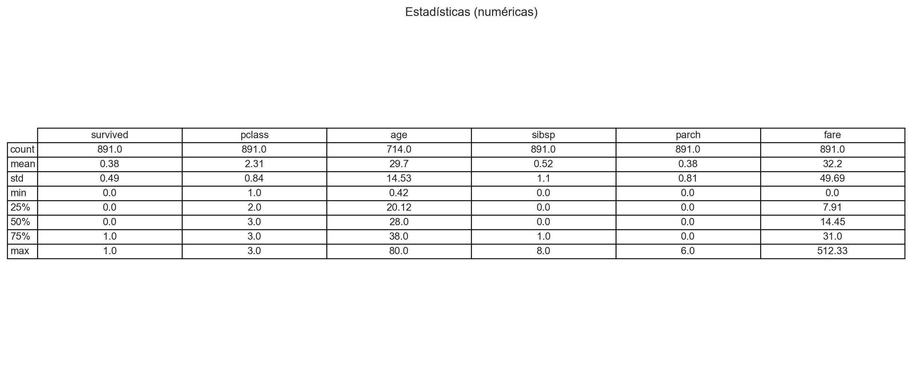

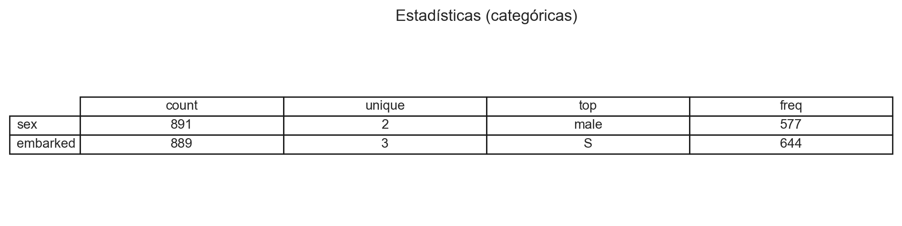

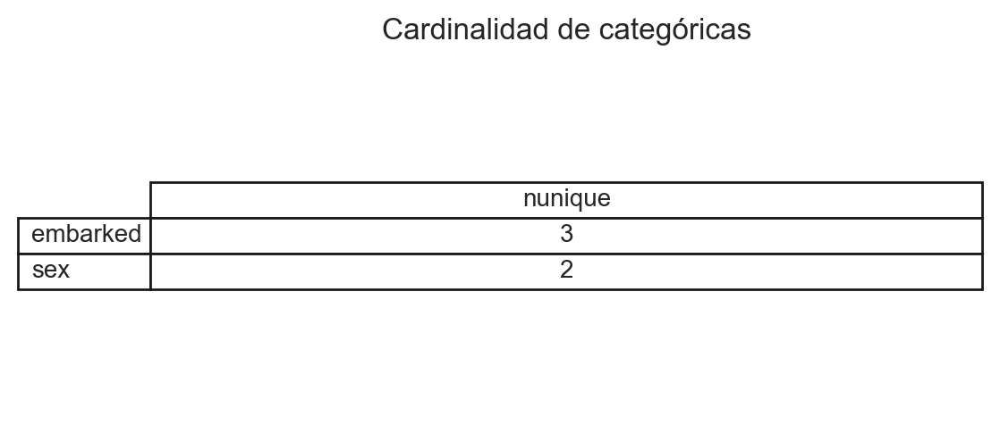

---

# FASE 3 Limpieza (Celda 4 a Celda 6)
## Celda 4 — limpieza (duplicados, imputación, feature)
### Imputa age con mediana (más robusta que media) Imputa embarked con moda Crea family_size = siblings + parents + 1

**Qué es:** Resultados tras limpiar duplicados, imputar y crear `family_size`.  
**Qué muestra:** Estado del dataset después de imputación; nulos restantes (si los hay).  
**Insight:** Dataset listo para análisis bivariado/multivariado y modelado básico.

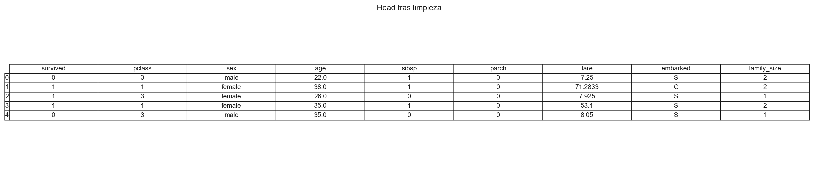

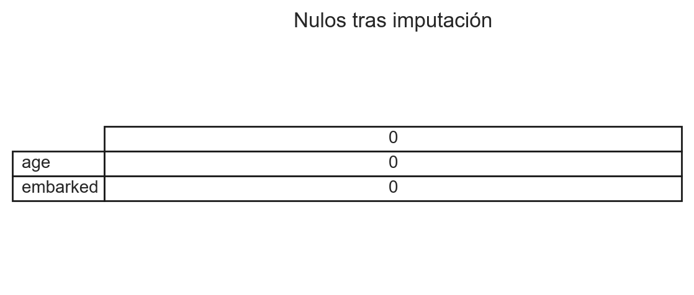


## Celda 5: Análisis Univariado (hist edad + conteos survived) 

**Qué es:** Histograma de `age` y barras de `survived` (con tabla de conteo).  
**Qué muestra:** Forma de la distribución de edades; balance de clases (0/1).  
**Insight:** Si hay fuerte desbalance en `survived`, afectará el modelado.

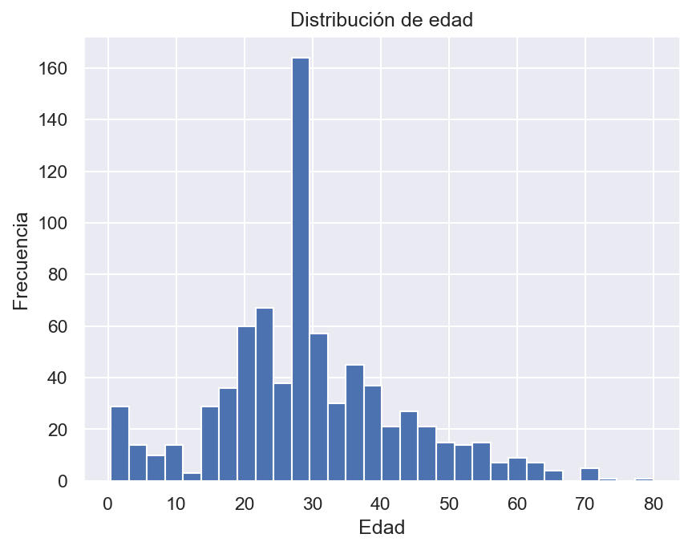


#### plot_hist_age.png
```bash
**Qué es:** Histograma de distribución de edades
**Qué muestra:** Pico en 20-30 años, pocos niños y ancianos
**Insight:** Mayoría pasajeros eran jóvenes adultos
```

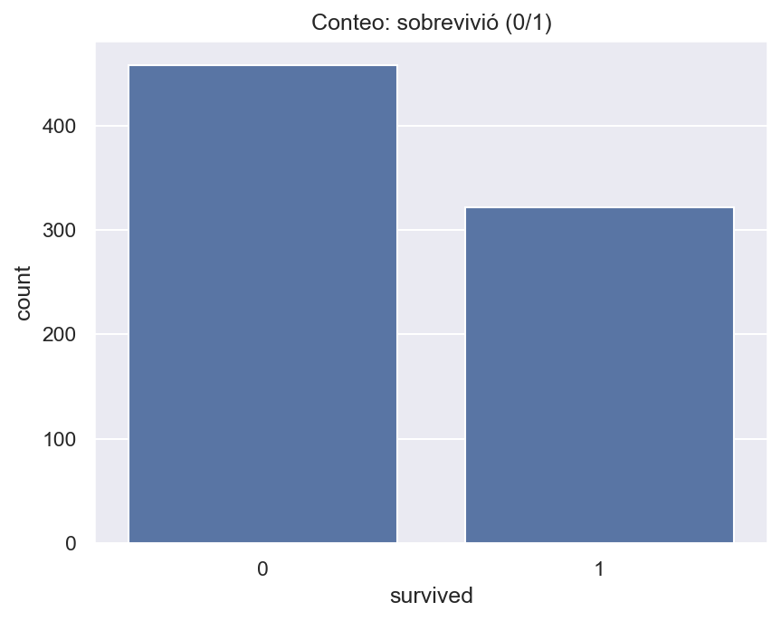

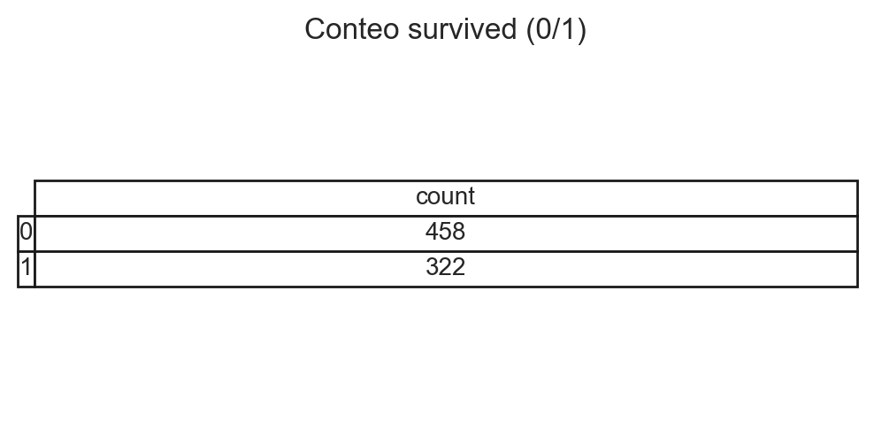

#### plot_count_survived.png
```bash
**Qué es:** Gráfico de barras de supervivencia
**Qué muestra:** 549 muertos vs 342 vivos (38% supervivencia)
**Insight:** Mayoría de pasajeros murió en el desastre
```

### Celda 6: Análisis Bivariado

**Qué es:** Comparaciones de `fare` y `sex` contra `survived`.  
**Qué muestra:** Supervivientes tienden a pagar **tarifas más altas**; mujeres sobreviven más que hombres.  
**Insight:** La **clase social** y el **sexo** influyen fuertemente en la supervivencia.

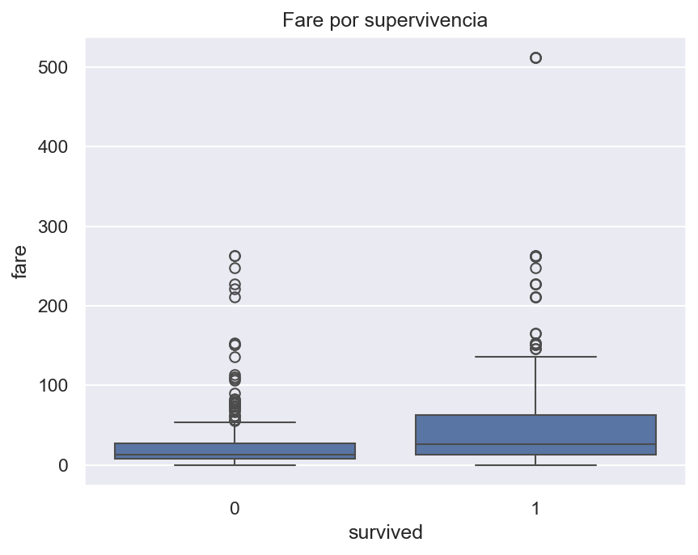

#### plot_box_fare_survived.png
```bash
**Qué es:** Boxplot de tarifas por supervivencia
**Qué muestra:** Supervivientes pagaron tarifas MÁS ALTAS
**Insight:** La clase social influyó en supervivencia
```

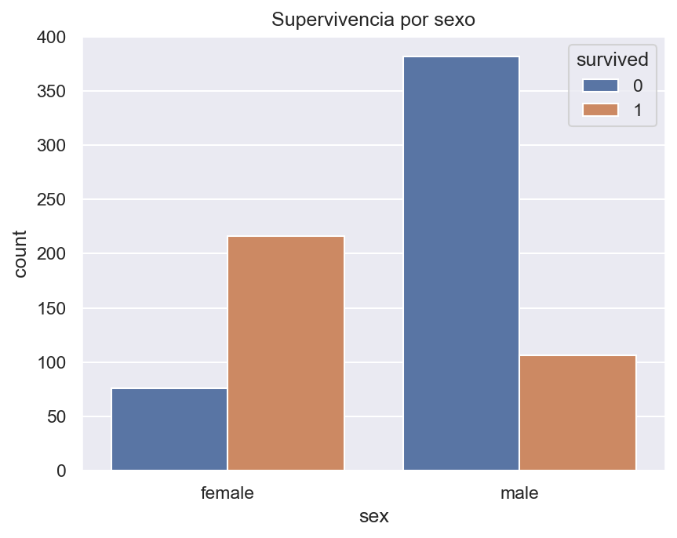

#### plot_count_sex_survived.png
```bash
**Qué es:** Barras agrupadas de sexo vs supervivencia
**Qué muestra:** Mayoría mujeres vivas, mayoría hombres muertos
**Insight:** "Mujeres y niños primero" se cumplió
```
---

# FASE 4 Análisis profundo. Outliers:
### Celda 7: Matriz de Correlación y outliers
### Detecta usando método IQR Conserva outliers como legítimos (ancianos, primera clase)


#### plot_corr_heatmap.png
```bash
**Qué es:** Matriz de correlación entre variables numéricas
**Qué muestra:** Relaciones entre edad, tarifa, clase, familia, etc.
**Insight:** Identificar variables redundantes
```

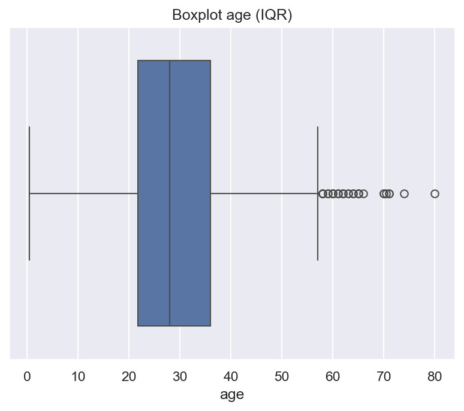

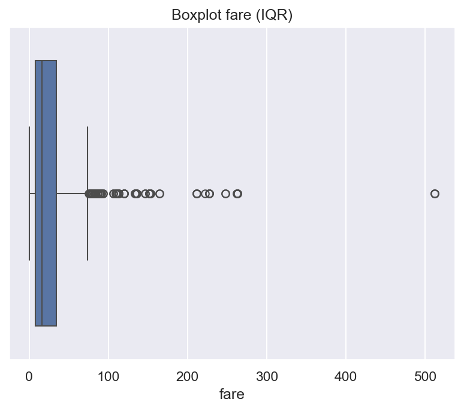

#### plot_box_age.png y plot_box_fare.png
```bash
**Qué son:** Boxplots para detección de outliers
**Qué muestran:** Ancianos y tarifas altas como valores atípicos
**Insight:** Outliers legítimos (no errores)
```

# Celda 8: Validación estadística. Tests de hipótesis:
### T-test: Confirma que supervivientes pagaron más (p < 0.05) Chi-cuadrado: Confirma asociación sexo-supervivencia (p < 0.05)

**Qué es:** Heatmap de correlaciones numéricas y boxplots con IQR para outliers.  
**Qué muestra:** Relaciones lineales entre numéricas; `fare` suele tener cola larga con outliers altos.  
**Insight:** Considerar **escalado/winsorización** en `fare` y revisar colinealidades antes del modelado.


---

# FASE 5 Conclusiones y preparación: (Celda 9: exportar CSVs limpios)

El análisis exploratorio de datos (EDA) proporciona una comprensión profunda de las características de los datos y sus relaciones. Al final de este proceso, es fundamental sintetizar los hallazgos, identificar problemas y formular recomendaciones para los siguientes pasos en el análisis o en la construcción de modelos.

```bash
Temas cubiertos:

- Hallazgos Principales

El objetivo del resumen es destacar los hallazgos más importantes y relevantes que surgieron del EDA. Estos hallazgos pueden incluir:

 **•	Distribuciones de las variables:** Cómo se distribuyen los datos (normal, sesgada, etc.).
 **•	Relaciones entre variables:** Identificación de correlaciones significativas o relaciones entre variables predictoras y la variable objetivo.**
 **•	Datos atípicos y valores faltantes:** Determinar si existen valores atípicos o si falta información importante en las variables.**
 **•	Características importantes:** Variables que tienen un impacto significativo en la variable objetivo, basadas en análisis estadísticos o técnicas de machine learning.**

Un buen resumen debe proporcionar una visión clara de las características del conjunto de datos y cómo estas características podrían influir en el modelo.

- Problemas Identificados

Durante el EDA, es común encontrar problemas que podrían afectar la calidad del análisis o la precisión de los modelos. Algunos de los problemas más comunes incluyen:

 **•	Valores faltantes:** Grandes cantidades de datos ausentes en algunas columnas que podrían afectar el rendimiento del modelo.**
 **•	Outliers:** Valores atípicos que pueden distorsionar las distribuciones y afectar la exactitud de los modelos predictivos.**
 **•	Multicolinealidad:** Variables altamente correlacionadas entre sí, lo que puede causar problemas en modelos de regresión lineales o algoritmos sensibles a la multicolinealidad.**
 **•	Distribuciones sesgadas:** Variables que no siguen una distribución normal y que pueden requerir transformaciones para mejorar el análisis.**

Identificar estos problemas es crucial para decidir cómo tratarlos antes de avanzar al modelado.

- Recomendaciones para Pasos Siguientes

Basado en los hallazgos y problemas identificados, se deben proponer recomendaciones claras para el análisis posterior. Algunas recomendaciones comunes incluyen:

 **•	Manejo de valores faltantes:** Imputar valores faltantes o eliminar registros, dependiendo de la cantidad y la importancia de los datos faltantes.
 **•	Tratamiento de outliers:** Eliminar, transformar o manejar los outliers, dependiendo de su impacto en el análisis.
 **•	Selección de características:** Elegir las características más relevantes basadas en su importancia para la variable objetivo, utilizando técnicas como la selección automática de características o la eliminación manual de aquellas con baja correlación.
 **•	Transformaciones de datos:** Normalizar o estandarizar variables cuando sea necesario para mejorar el rendimiento de ciertos modelos.
 **•	Pruebas de validación:** Realizar validaciones cruzadas o pruebas adicionales para verificar la calidad del modelo antes de la implementación.
```


## 🎯 INSIGHTS PRINCIPALES DESCUBIERTOS tras el análisis de los datos:
```bash
- Factor género es CRÍTICO 
- Diferencia dramática hombre vs mujer Clase social importa 
- Tarifas altas = mayor supervivencia Protocolo marítimo cumplido 
- "Mujeres y niños primero" Variables engineered útiles 
- family_size puede mejorar predicciones Datos de calidad 
- Pocos problemas tras limpieza
```

## 📋 ARCHIVOS CSV obtenidos (Celda 9) (2 datasets procesados):

#### 1. titanic_clean.csv
```bash
Qué es: Datos originales pero limpios
Contiene: Valores imputados, sin duplicados, tipos corregidos
Uso: Para análisis posterior manteniendo interpretabilidad
```

#### 2. titanic_encoded.csv
```bash
Qué es: Datos codificados para Machine Learning
Contiene: Variables categóricas convertidas a números (one-hot encoding)
Uso: Listo para entrenar algoritmos de IA
```


Este script es un ejemplo perfecto de EDA profesional aplicando toda la teoría que estudiamos.

